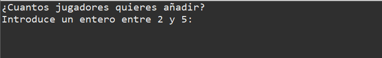
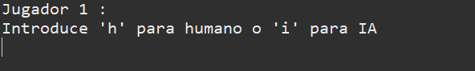
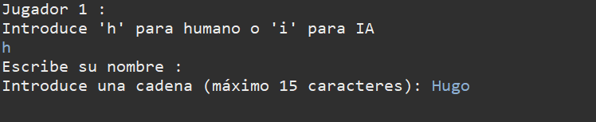
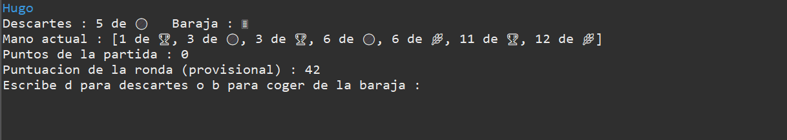
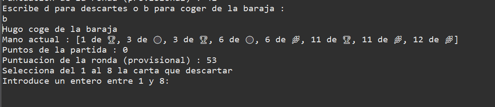
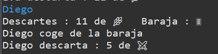
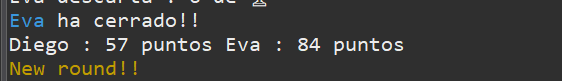
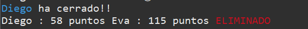
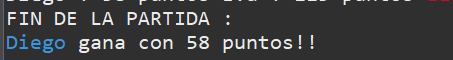

# 🎴 Chinchón

> Un juego de cartas jugado con la baraja española, donde los jugadores intentan formar escaleras o grupos para cerrar y ganar rondas.

---

## 📋 Reglas del Juego

- **Cartas iniciales**: Cada jugador comienza con 7 cartas
- **Turnos**: En cada turno, el jugador elige coger de descartes o baraja boca abajo, luego descarta para mantener 7 cartas
- **Combinaciones válidas**: Mínimo 3 cartas
  - Escaleras del mismo palo
  - Grupos del mismo número
- **Objetivo**: Tener el mínimo número de puntos posible o formar un **Chinchón**
- **Chinchón**: Escalera de 7 cartas (victoria automática)
- **Condición de cierre**: Solo puedes cerrar si tienes una carta sin combinar de valor 1-5, todas las cartas combinadas, o Chinchón
- **Puntuación de ronda**:
  - Cartas sin combinar: Se suma su valor a la puntuación total
  - Todas combinadas: Se restan 10 puntos
  - Chinchón: Victoria automática de la partida
- **Eliminación**: Un jugador es eliminado al alcanzar 100 puntos
- **Ganador**: El último jugador en pie

---

## ⚙️ Características del Proyecto

- ✅ Nomenclatura de funciones, clases y variables completamente en **inglés**
- ✅ Interfaz de usuario mediante consola (`ConsoleInput`)
- ✅ Patrón Singleton para `GameEngine`
- ✅ Factory Pattern para creación de jugadores
- ✅ Soporte para jugadores humanos e IA
- ✅ Colores ANSI en la salida de consola

---

## 📁 Estructura del Proyecto

```
Chinchon
├─ docs/
│  ├─ clases/
│  │  ├─ gameEngine.md
│  │  ├─ gameLoop.md
│  │  ├─ gameManager.md
│  │  ├─ scoreCalculator.md
│  │  ├─ deckManager.md
│  │  ├─ consoleInput.md
│  │  ├─ main.md
│  │  ├─ player.md
│  │  ├─ human.md
│  │  ├─ ai.md
│  │  ├─ handAnalyzer.md
│  │  ├─ card.md
│  │  ├─ deck.md
│  │  ├─ gameConstants.md
│  │  ├─ suit.md
│  │  ├─ value.md
│  │  ├─ colors.md
│  │  ├─ playerFactory.md
│  │  └─ playerType.md
│  └─ chinchonUML.png
├─ README.md
├─ src/
│  └─ chinchon/
│     ├─ app/
│     │  ├─ ConsoleInput.java
│     │  ├─ DeckManager.java
│     │  ├─ GameEngine.java
│     │  ├─ GameLoop.java
│     │  ├─ GameManager.java
│     │  ├─ Main.java
│     │  └─ ScoreCalculator.java
│     └─ dominio/
│        ├─ AI.java
│        ├─ Card.java
│        ├─ Colors.java
│        ├─ Deck.java
│        ├─ GameConstants.java
│        ├─ HandAnalyzer.java
│        ├─ Human.java
│        ├─ Player.java
│        ├─ PlayerFactory.java
│        ├─ PlayerType.java
│        ├─ Suit.java
│        └─ Value.java
└─ test/
   └─ dominio/
      ├─ DeckManagerTest.java
      ├─ DeckTest.java
      ├─ HandAnalyzerTest.java
      ├─ PlayerFactoryTest.java
      └─ PlayerTest.java
```

---

## 📚 Explicación de Clases

Para una explicación detallada de cada clase, haz click en su nombre.

### 🎮 Clases de la Aplicación (app)

Estas clases controlan el flujo general del juego:

| Clase | Descripción |
|-------|-------------|
| [**GameEngine**](docs/clases/gameEngine.md) | Clase principal usando patrón Singleton. Coordina el flujo general del juego. |
| [**GameManager**](docs/clases/gameManager.md) | Gestiona el estado del juego (jugadores, mazo, descartes). |
| [**GameLoop**](docs/clases/gameLoop.md) | Ejecuta el bucle principal de turnos y rondas. |
| [**ScoreCalculator**](docs/clases/scoreCalculator.md) | Calcula puntuaciones y determina el final de la partida. |
| [**DeckManager**](docs/clases/deckManager.md) | Administra la baraja y su preparación. |
| [**ConsoleInput**](docs/clases/consoleInput.md) | Gestiona la entrada del usuario desde la consola. |
| [**Main**](docs/clases/main.md) | Punto de entrada de la aplicación. |

### 👥 Clases de Jugadores (dominio)

Implementan la lógica de diferentes tipos de jugadores:

| Clase | Descripción |
|-------|-------------|
| [**Player**](docs/clases/player.md) | Clase abstracta base para todos los jugadores. |
| [**Human**](docs/clases/human.md) | Jugador humano con control interactivo. |
| [**AI**](docs/clases/ai.md) | Jugador controlado por inteligencia artificial. |
| [**PlayerFactory**](docs/clases/playerFactory.md) | Factory para crear jugadores del tipo especificado. |
| [**PlayerType**](docs/clases/playerType.md) | Enum con tipos de jugadores disponibles. |

### 🃏 Clases de Cartas y Baraja (dominio)

Representan los elementos de la baraja:

| Clase | Descripción |
|-------|-------------|
| [**Card**](docs/clases/card.md) | Representa una carta individual con palo y valor. |
| [**Deck**](docs/clases/deck.md) | Gestiona la baraja y sus operaciones. |
| [**Suit**](docs/clases/suit.md) | Enum con los cuatro palos de la baraja española. |
| [**Value**](docs/clases/value.md) | Enum con los valores de las cartas. |

### 🔧 Clases de Análisis y Utilidades (dominio)

Proporcionan funcionalidad auxiliar:

| Clase | Descripción |
|-------|-------------|
| [**HandAnalyzer**](docs/clases/handAnalyzer.md) | Analiza manos, detecta combinaciones y calcula puntuación. |
| [**GameConstants**](docs/clases/gameConstants.md) | Constantes centralizadas del juego. |
| [**Colors**](docs/clases/colors.md) | Códigos ANSI para colorear la salida de consola. |

---

## 📝 Notas de Desarrollo

- El proyecto usa la baraja española estándar (40 cartas)
- La IA toma decisiones basadas en análisis de puntuación
- Se incluyen colores ANSI para mejor experiencia visual en la consola

## 🚦 Flujo de ejecución

A continuación se describe, paso a paso, el flujo de interacción principal durante una partida. Cada paso incluye una captura ubicada en `docs/screenshots/`.

1) Selección del número de jugadores (2-5)

  

2) Para cada jugador: elegir tipo (IA o Humano)

  

3) Asignar nombre al jugador

  

4) Turno de jugador humano — interfaz de turno

  - Se muestra la mano actual (las cartas combinadas aparecen en verde).
  - Se muestra la puntuación provisional de la ronda (si se cerrara ahora).
  - Se muestra la puntuación total acumulada.
  - Se muestra la carta superior de la pila de descartes y la opción de coger descartes o baraja.

  

5) Acción del jugador y descarte

  - Tras elegir, se muestra la acción (por ejemplo: "Hugo coge de la baraja").
  - La mano temporal puede tener 8 cartas; el jugador selecciona la posición (1-8) para descartar.

  

6) Turno de IA

  - No se muestran las cartas privadas de la IA.
  - Se muestra la carta superior de la pila de descartes, la acción tomada por la IA (coger de baraja o descartes) y la carta descartada por la IA.

  

7) Cierre de ronda

  - Cuando un jugador cierra se anuncia por consola, se calculan y actualizan las puntuaciones y se muestra la clasificación antes de la siguiente ronda.

  

8) Eliminación de jugadores

  - Si un jugador supera los **100** puntos aparece marcado como **ELIMINADO** y no participa en las siguientes rondas.

  

9) Fin de la partida

  - Al terminar la partida se muestra el ganador y la puntuación final.

  

El flujo termina cuando la partida ha finalizado.


## 🧪 Justificación de los Tests
Los tests son una forma de verificar el funcionamiento de nuestros métodos de la forma más aislada y pequeña posible.


### **📌 Estrategia de Pruebas**
Sigo una estrategia híbrida de pruebas, combinando blackbox (no conocemos el código interno) y whitebox (conociendo el código interno).
Esto nos garantiza cobertura de funcionalidad y de código, aunque en este caso solo hemos hecho una prueba de caja blanca.
Para hacerlas he usado JUnit 5 con aserciones que me ayudaron a validar comportamientos y estados.

---

### **📂 Organización de los Tests**
Los tests están ubicados en:
- **`test/dominio/`**: Tests para las clases del **dominio del juego** (cartas, manos, jugadores).
  - **Importante** separación de las pruebas en una carpeta distinta, para separarlos de las clases que se ocupan de la lógica en src.

**Clases probadas**:
   Clase | Tipo de Prueba | Objetivo |
 |-------|----------------|----------|
 | [`Deck`](src/chinchon/dominio/Deck.java) | Caja negra | Validar creación, barajado y robo de cartas. |
 | [`DeckManager`](src/chinchon/app/DeckManager.java) | Caja negra y blanca | Validar gestión del mazo y reabastecimiento. |
 | [`HandAnalyzer`](src/chinchon/dominio/HandAnalyzer.java) | Caja negra | Validar detección de combinaciones (escaleras, grupos) y cálculo de puntos. |
 | [`PlayerFactory`](src/chinchon/dominio/PlayerFactory.java) | Caja negra | Validar creación correcta de jugadores (Human/AI). |
 | [`Player`](src/chinchon/dominio/Player.java) | Caja negra | Validar gestión de nombre y puntuación. |

---
### **⚙️ Diseño y justificación de Pruebas de Caja Negra**
**Objetivo**: Validar que las clases cumplen con el comportamiento que esperamos.

**Ejemplos**:
- **`DeckTest`**:
  - `createDeck40Cards()`: Verifica que un mazo estándar tenga **40 cartas** (baraja española).
  - `testDrawCard_ReduceDeck()`: Asegura que al robar una carta, el mazo se reduce en 1.
  - `testShuffle()`: Confirma que el barajado cambia el orden de las cartas.
  **→ [Ver código](test/dominio/DeckTest.java)**

- **`HandAnalyzerTest`**:
  - `testUncombinedCardsChinchon()`: Valida que una mano con **Chinchón** (7 cartas consecutivas del mismo palo) tenga **0 cartas sin combinar**.
  - `testCanClose_true()`: Verifica que un jugador **puede cerrar** si su mano cumple las reglas.
  **→ [Ver código](test/dominio/HandAnalyzerTest.java)**

- **`PlayerFactoryTest`**:
  - `testCreateHuman()` y `testCreateAi()`: Aseguran que la fábrica crea instancias correctas de `Human` o `AI` según el tipo solicitado.
  **→ [Ver código](test/dominio/PlayerFactoryTest.java)**

---

### **🔍 Diseño y Justificación de Pruebas de Caja Blanca**
**Objetivo**: Validar condiciones de borde en métodos clave para el funcionamiento.

**Ejemplo en [`DeckManagerWhiteBoxTest`](test/dominio/DeckManagerWhiteBoxTest.java)**:
- **`testCheckAndRefillDeck_NoRefillWhenDeckNotEmpty()`**:
  - **Caso**: Mazo con cartas + descartes.
  - **Validación**: El mazo **no debe reabastecerse** si ya tiene cartas.
  - **Razón**: Evitar comportamientos no deseados al reabastecer innecesariamente.

- **`testCheckAndRefillDeck_OnlyOneDiscard_LeftAsIs()`**:
  - **Caso**: Mazo vacío + **1 sola carta en descartes**.
  - **Validación**: El mazo **permanece vacío** y el descarte **no se modifica**.
  - **Razón**: Según las reglas del juego, **no se puede reabastecer el mazo con solo 1 carta en descartes**.

- **`testCheckAndRefillDeck_MultipleDiscards_ReplenishLeavesOne()`**:
  - **Caso**: Mazo vacío + **múltiples cartas en descartes**.
  - **Validación**: El mazo se rellena con **todas las cartas de descartes menos 1** (que permanece como carta superior del descarte).
  - **Razón**: Cumplir la regla del juego: *"Si la baraja se agota, se barajan los descartes (manteniendo la carta superior) y se reutilizan como nuevo mazo"*.

---

### **📸 Evidencias de Ejecución**
Las capturas de pantalla adjuntas demuestran:
1. **Test HandAnalyzer**:
   - Ejecución exitosa de pruebas para `Deck` y `HandAnalyzer`.
   - **Resultados**: Todos los tests pasan, validando el análisis del conjunto de cartas del jugador.
    

2. **Test de caja blanca de DeckManager**:
   - Ejecución de `DeckManagerWhiteBoxTest`.
   - **Resultados**: Validación de caminos lógicos en `checkAndRefillDeck`.
   

3. **Test de caja negra de DeckManager**:
   

4. **Test Deck**
   

5. **Test PlayerFactory**
   

6. **Test Player**
   


 
 


## Aclaraciones / Notas

- **Número de barajas**: Si hay 3 o más jugadores se usan 2 barajas; cuando queden 2 jugadores se jugará con 1 baraja.
- **Reabastecer mazo**: Si la baraja se agota, se baraja la pila de descartes (manteniendo la carta superior) y se reutiliza como nuevo mazo.
- **Pausas**: Se usan pausas (`Thread.sleep`) para dar tiempo a visualizar las acciones de la IA.


